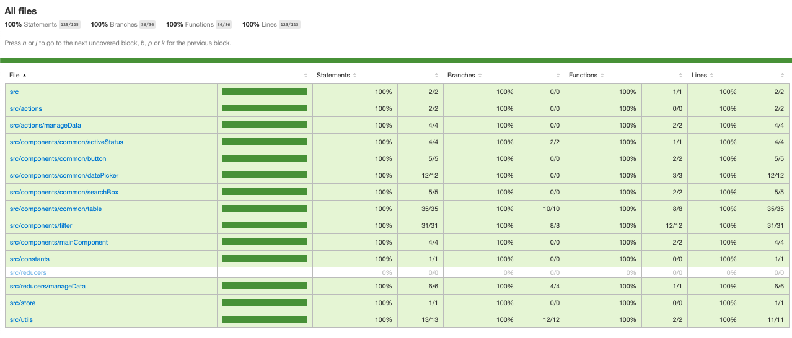

This project was bootstrapped with [Create React App](https://github.com/facebook/create-react-app).

The project is available on this [URL](https://snehangshu-campaign-list.netlify.com/)

## Application Details

This is an application which takes in an Array of the campaign objects and displays it in tabular form. You can filter the data using Start/End dates and/or the Campaign Name.

You can open the console on your browser, and call the `AddCampaigns()` method to add the data.

The following technologies have been used in this application:
* Javascript
* ReactJS
* Redux
* Bootstrap
* Jest
* Enzyme
* Sinon

 100% Unit Test Case coverage has been achieved for this application

 

## Available Scripts

In the project directory, you can run:

### `npm start`

Runs the app in the development mode. 
Open [http://localhost:3000](http://localhost:3000) to view it in the browser(will open automatically).

The page will reload if you make edits. 
You will also see any lint errors in the console.

### `npm run test`

Launches the test runner. 
See the section about [running tests](https://facebook.github.io/create-react-app/docs/running-tests) for more information.

### `npm run build`

Builds the app for production to the `build` folder. 
It correctly bundles React in production mode and optimizes the build for the best performance.

The build is minified and the filenames include the hashes. 
Your app is ready to be deployed!

See the section about [deployment](https://facebook.github.io/create-react-app/docs/deployment) for more information.
